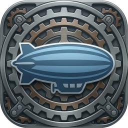

<div align="center">


<h1>Zeppelin</h1>
  


<br/>

Available at<br/>
[](https://github.com/jszczerbinsky/zeppelin/releases)
[](https://codeberg.org/jszczerbinsky/zeppelin/releases)
[](https://aur.archlinux.org/packages/zeppelin-git)

</div>
<div align="center">
Zeppelin is a free, open-source chess engine, compatible with <a href="https://en.wikipedia.org/wiki/Universal_Chess_Interface">UCI</a> protocol, optimized for x86_64 and aarch64 CPUs, working under Windows and Linux. Use it to play with, analyze your games, or challenge it against other engines.
</div>

## Installation

You can download pre-compiled version from [releases](https://github.com/jszczerbinsky/zeppelin/releases/). To use the engine, unpack the file somewhere in the filesystem and specify the path to zeppelin executable in Your GUI program. Since v0.1.0 version, the program contains only an executable, without any additional binary files, thus specifying a working directory is no longer necessary.

#### Building from source
If You want to build the program from source, You'll need **cmake** and **gcc** (or **mingw** on Windows). Using **ccmake** or **cmake-gui** is the easiest way to specify all the parameters, that cmake needs to build the engine. Cross compiling is possible, but only one way - from Linux to Windows.

```bash
git clone https://github.com/jszczerbinsky/zeppelin/
cd zeppelin

# You may use cmake-gui . instead of ccmake
ccmake .

cmake --build .
```

The executable should appear in `build/` directory.

If You want to rebuild the program with overriden files in `res/` directory, You should delete all `.o` files in project root. Otherwise the previous ones will be linked.

